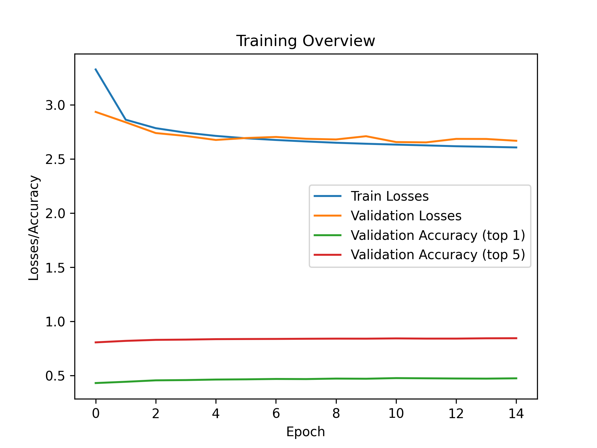

# Mini-KataGo

A basic implementation of Go AI, similar to [KataGo](https://github.com/lightvector/KataGo).

## Data/Model Download

For the processed and raw datasets, please check out this url on [Google Drive](https://drive.google.com/drive/folders/1Brh3DSuQ2fcs2gPFlytn4BvrR4j-qWHK?usp=sharing)

For the .pt model, please checkout this url on [Google Drive](https://drive.google.com/drive/folders/12OCXJz11Ely8U9kf6R822n4Apfg3QOef?usp=sharing)

## Training Result Overview

NN training graph:



Sample training log:

```log
2026-02-14 09:02:29 | INFO | training | Starting training
2026-02-14 09:02:29 | INFO | training | Total epoch = 10
2026-02-14 09:02:29 | INFO | training | Board size = 9
2026-02-14 09:02:29 | INFO | training | Batch size = 256
2026-02-14 09:02:30 | INFO | training | train_dataset length: 1334166
2026-02-14 09:02:30 | INFO | training | val_dataset length: 165765
2026-02-14 09:02:30 | INFO | training | test_dataset length: 165807
2026-02-14 09:07:35 | INFO | training | Epoch 5 finished | train_loss = 2.6912 | val_loss = 2.6936 | val_acc1 = 0.4633 | val_acc5 = 0.8359
2026-02-14 09:12:38 | INFO | training | Epoch 6 finished | train_loss = 2.6755 | val_loss = 2.7035 | val_acc1 = 0.4667 | val_acc5 = 0.8368
2026-02-14 09:17:53 | INFO | training | Epoch 7 finished | train_loss = 2.6620 | val_loss = 2.6867 | val_acc1 = 0.4657 | val_acc5 = 0.8383
2026-02-14 09:23:37 | INFO | training | Epoch 8 finished | train_loss = 2.6499 | val_loss = 2.6805 | val_acc1 = 0.4702 | val_acc5 = 0.8395
2026-02-14 09:29:22 | INFO | training | Epoch 9 finished | train_loss = 2.6407 | val_loss = 2.7104 | val_acc1 = 0.4689 | val_acc5 = 0.8392
2026-02-14 09:35:19 | INFO | training | Found a better state at epoch 10
2026-02-14 09:35:19 | INFO | training | Epoch 10 finished | train_loss = 2.6327 | val_loss = 2.6564 | val_acc1 = 0.4747 | val_acc5 = 0.8416
2026-02-14 09:41:24 | INFO | training | Found a better state at epoch 11
2026-02-14 09:41:24 | INFO | training | Epoch 11 finished | train_loss = 2.6255 | val_loss = 2.6533 | val_acc1 = 0.4727 | val_acc5 = 0.8397
2026-02-14 09:47:25 | INFO | training | Epoch 12 finished | train_loss = 2.6176 | val_loss = 2.6856 | val_acc1 = 0.4709 | val_acc5 = 0.8398
2026-02-14 09:53:44 | INFO | training | Epoch 13 finished | train_loss = 2.6127 | val_loss = 2.6849 | val_acc1 = 0.4699 | val_acc5 = 0.8426
2026-02-14 10:00:11 | INFO | training | Epoch 14 finished | train_loss = 2.6067 | val_loss = 2.6682 | val_acc1 = 0.4727 | val_acc5 = 0.8433
2026-02-14 10:00:24 | INFO | training | TEST | loss = 2.7019 | acc1 = 0.4711 | acc5 = 0.8416
2026-02-14 10:00:24 | INFO | training | Total training time: 3475.0965 seconds
2026-02-14 10:00:52 | INFO | training | Training end
```

## Timeline

### Week 1

Implemented basic Go board engine and a simple minimax file for tac-tac-toe that will be later used for Go as a depth-limited MiniMax (and probably see it fails badly)

New features include:

- Place move at specific position with specific color
- Captures detection
- Ko detection
- Score estimation at the end of the game
- Illegal move detection
- Display a real Go board with MatPlotLib

### Week 2

Implemented a basic depth-limited MiniMax algorithm for Go with alpha-beta pruning. It checks all possible moves in a given board state and choose the local optimal one by choosing the move that captures the most opponent's stones. Also did some minor updates to the board class.

New features include:

- Depth-limited Minimax algorithm with alpha-beta pruning
- Auto game-over when there are 2 consecutive passes
- Undo feature for game board

### Week 3 + 4

Implemented a basic Monte Carlo Tree Search for Go, as well as a Node class. The algorithm works by randomly choose legal position to play and calculate the UCT (Upper Confidence Bound applied to Trees). At the end, it picks the node with the most visits to ensure stability.

New features include:

- A basic Monte Carlo Tree Search for Go
- A new Node class data structure

### Week 5 + 6 + 7

Implemented a Convolution Neural Network (CNN) for Go with PyTorch. It works along with a policy network and a value network that allows the MCTS to perform better searching. Also refactored file structure so it's more sorted.

New features include:

- A decent Neural Network that learn from over 400 9\*9 Go .sgf files.
- Comprehensive logging when training
- Pre-computed dataset
- Model auto-saving

### Week 8

Combined Monte Carlo Tree Search with Neural Network, similar to how AlphaZero works. It uses a PUCT (prior upper confidence score for trees) score instead of the ordinary UCT, (or "UCB"), in order to balance exploration and exploitation.

New features include:

- Combination of Monte Carlo Tree Search and Neural Network
- Stronger NN with more datasets
- Minor bug fixes for board.py

### Week 9 + 10 + 11

Improved Monte Carlo Tree Search to ensure that there is no logical errors. Moved training process to AWS EC2 for better efficiency and memory.

New features include:

- Optimized Monte Carlo Tree Search
- Better training settings for CUDA GPU

## Src File structure

```yaml
mini-katago/
├── src/                                    # All Python files
│   ├── mini_katago/                        # Go related files
│   │   │── go                              # All Python files related to Go, such as board.py and rules.py
│   │   │   ├── board.py                    # Python class that represents a Go game board
│   │   │   ├── game.py                     # Python class that represents a Go game, including board, players, and the winner
│   │   │   ├── move.py                     # Python class that represents a move in a game of Go
│   │   │   ├── player.py                   # Python class that represents a player in a game of Go
│   │   │   ├── rules.py                    # Python class that contains various rules for Go
│   │   │── mcts                            # All Python files related to Monte Carlo Tree Search, such as search.py
│   │   │   ├── node.py                     # A custom Node data structure class used for Monte Carlo Tree Search
│   │   │   ├── search.py                   # A python program that searches for the most optimum move given the board and player
│   │   │── misc                            # All Python files that are not absolutely essential to this project
│   │   │   ├── minimax.py                  # A depth-limited MiniMax algorithm for Go with alpha-beta pruning
│   │   │── nn                              # All neural network related files
│   │   │   ├── datasets/
│   │   │   │   ├── gokifu_download.py      # A Python program that automatically downloads professional games from Gokifu website
│   │   │   │   ├── precomputed_dataset.py  # A class that represents a pre-computed dataset
│   │   │   │   ├── sgf_dataset.py          # A one-time running file that generates all the datasets
│   │   │   │   ├── sgf_parser.py           # An util file that parses SGF files and convert it to a Game object
│   │   │   ├── agent.py                    # The agent that loads the model and pick a move
│   │   │   ├── evaluate.py                 # A function that evaluate the training result based on the validation dataset
│   │   │   ├── model.py                    # The PolicyValueNetwork CNN model
│   │   │   ├── play.py                     # A file that is mainly used for testing (e.g., nn v.s. nn and human v.s. nn)
│   │   │   ├── split.py                    # Splits the game into training, validation, and testing set
│   │   │   ├── train.py                    # Runs the actual training with 30 epochs
│   │   │── constants.py                    # A file containing all the essential constants used in the project
│   │   │── main.py                         # A file for testing
│   │   │── utils.py                        # Some utility functions
```

## Development

To start developing this project locally. Run the following command:

Install UV:

```bash
uv --version  # check if UV is already installed

# If it is not installed
curl -LsSf https://astral.sh/uv/install.sh | sh  # MacOS & Linux
# or
powershell -ExecutionPolicy ByPass -c "irm https://astral.sh/uv/install.ps1 | iex"  # Windows
```

Clone the repository and setup:

```bash
git clone https://github.com/YianXie/Mini-KataGo  # Clone this repository
cd Mini-KataGo
uv init  # initialize the virtual environment
uv sync --dev  # install the dependencies
source .venv/bin/activate  # activate the virtual environment
```

Now you are ready to start developing. To see a quick demo, you may go the `main.py` and try a few different .sgf files or play your own.

Happy developing!

## Tests

This project contains some tests that you can run while developing to make sure everything works as expected.

To run tests:

```bash
uv init  # initialize the virtual environment if you haven't already done it
uv sync --dev  # install all the dependencies
```

```bash
pytest  # Run at root level. This would run all tests.
```

To add more tests, simply add a new Python file in the `tests/` directory. Note that it must start with `test_xxx` or `xxx_test`

## CI/CD

This project uses GitHub Actions for continuous integration. The `ci.yml` workflow runs on every push and pull request, performing code quality checks including Ruff linting, Mypy type checking, isort import sorting validation, and pip-audit security scanning. The `tests.yml` workflow runs pytest tests on pushes to the main branch and all pull requests targeting main, ensuring that all tests pass before code is merged.
